<div align="center">

# Meridian — Dashboard

### The SEO manager spends fifteen minutes a day, not eight hours.

The React front end of a campaign-aware SEO operations platform: it runs the audit, builds the keyword
map, writes the on-page content, rotates the daily off-page work, tracks Google positions every night and
drafts the client report — and **remembers every action**, so the next decision is informed by the last one.

[](https://react.dev)
[](https://vite.dev)
[](https://tailwindcss.com)
[](https://tanstack.com/query)
[](https://recharts.org)
[](https://vercel.com)

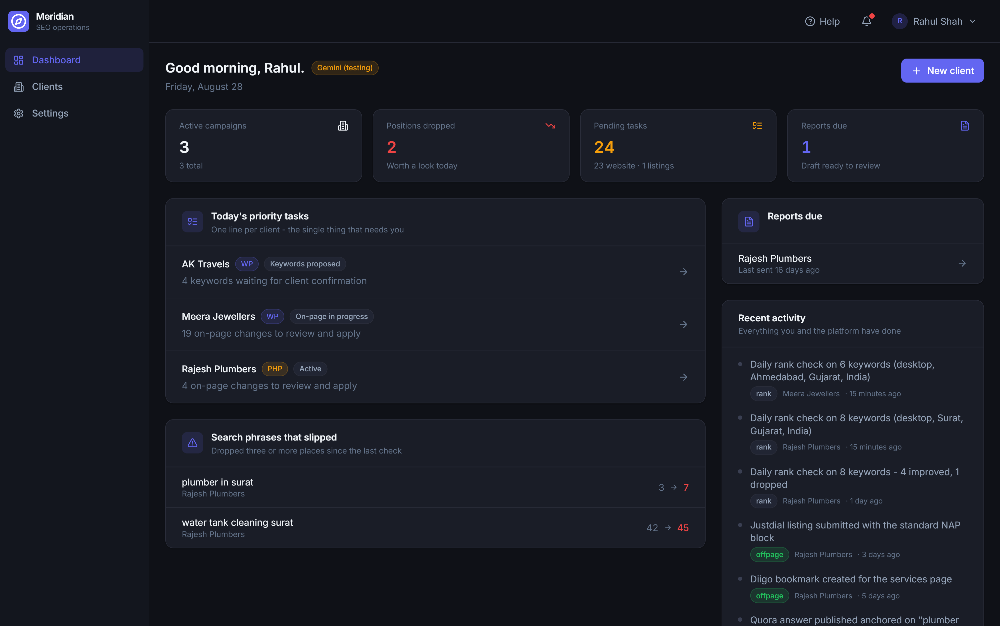
link: https://meridian-dashboard-green.vercel.app/

</div>

---

## Two repositories

This is one half of the product.

| | Repository | Visibility | Runs on |
| --- | --- | --- | --- |
| **Dashboard** | `meridian-dashboard` — you are here | public | Vercel (static) |
| **API** | `meridian-api` | private | Render (Node + Postgres + Redis) |

The API is private because it holds the model prompts, the provider integrations, the encryption of
stored client credentials, and the deployment blueprint. This repository holds no secret of any kind:
Vite compiles every `VITE_` variable straight into the JavaScript it ships, so anything in `.env` here
is public by construction, and both env files are written on that assumption.

**They are deployed apart but served as one origin.** `vercel.json` rewrites `/api/*` to the Render
service, so the browser only ever sees the Vercel domain:

```
                            browser
                               │
                               ▼
              https://meridian-xxxx.vercel.app       <-- the only origin anyone sees
              ┌──────────────────────────────┐
              │  /            the React app  │   static, no cold start
              │  /api/*  ──── rewrite ───────┼───►  meridian-api on Render
              └──────────────────────────────┘            │
                                                          ├── Neon Postgres + pgvector
                                                          └── Render Key Value (BullMQ)
```

That rewrite is load-bearing, not a convenience. The app calls a relative `baseURL: '/api'`, the
session cookies are `SameSite=Lax`, and the CSRF defence is a double-submit that reads a cookie with
`document.cookie` — all three of which need the API to look same-origin to the browser. Point the app
straight at the Render domain instead and the login dies on the next page refresh, silently.

---

## The problem it solves

An in-house SEO manager handling a dozen small-business clients spends the day on mechanical work:
re-auditing sites, re-researching keywords they already researched, writing meta titles by hand,
remembering which directory they submitted to last Tuesday, and rebuilding the same report twice a month
from scratch. None of it is hard. All of it is slow, and none of it is remembered anywhere except in
their head.

Meridian does that work and keeps the record. Every audit, phrase, content change, listing and position
lands in one campaign history — and that history is fed back into every generation, so the platform never
proposes work it already did.

| Step | Who does it | What happens |
| --- | --- | --- |
| 1. Onboarding | Manager | Business, domain, CMS, cities, NAP block. Baseline audit runs immediately. |
| 2. Keyword research | Platform | Volume + difficulty per phrase, then mapped one primary per page. |
| 3. Confirmation | Client, via the manager | Copy the list to WhatsApp, confirm what comes back, lock it. |
| 4. On-page + technical | Platform | Meta, OG, H1, paragraphs, schema, robots.txt, sitemap.xml, llms.txt — each with paste-ready instructions for that CMS. |
| 5. Apply | Manager | Copy-paste, or one-click push to WordPress with a rollback snapshot. |
| 6. Off-page, daily | Platform + manager | Next platform chosen so nothing repeats inside its cooldown; package pre-filled. |
| 7. Ranks, nightly | Platform | Google position per phrase; drops over 3 places raise an alert. |
| 8. Report, day 1 and 15 | Platform | Drafted from rank deltas and the activity log; manager reviews, sends as PDF. |
| 9. Client questions | Platform | "Why is this not ranking?" answered from the campaign record, with dates. |

---

## What it looks like

<table>
<tr>
<td width="50%">

**Nightly Google positions**
Every confirmed phrase, checked at midnight. The y-axis is reversed because position 1 belongs at the top.

</td>
<td width="50%">

**On-page changes, paste-ready**
Not "improve your meta title" — the exact text, plus where in *this* CMS to put it.

</td>
</tr>
<tr>
<td>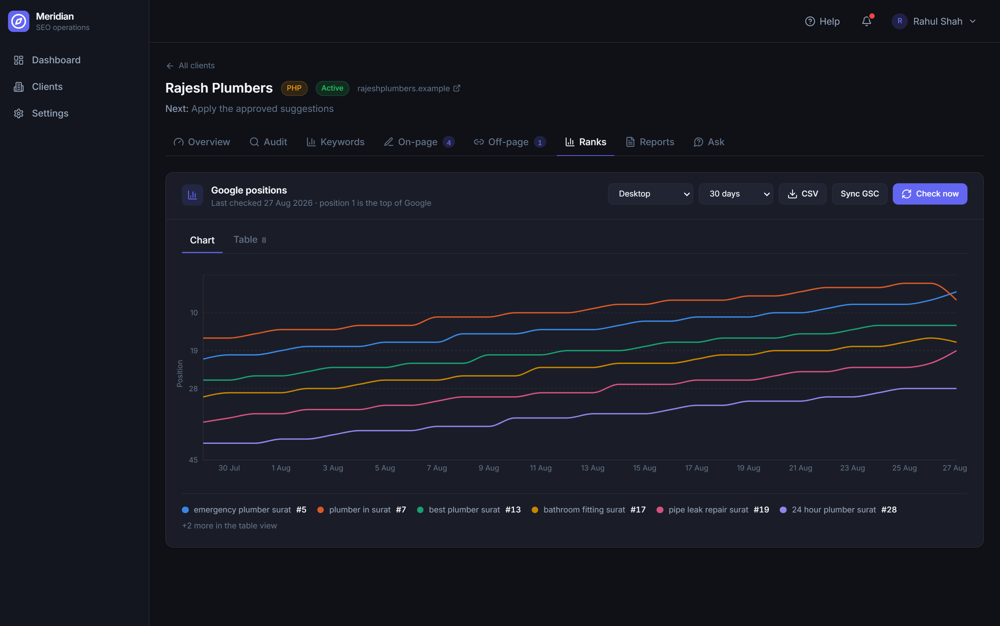</td>
<td>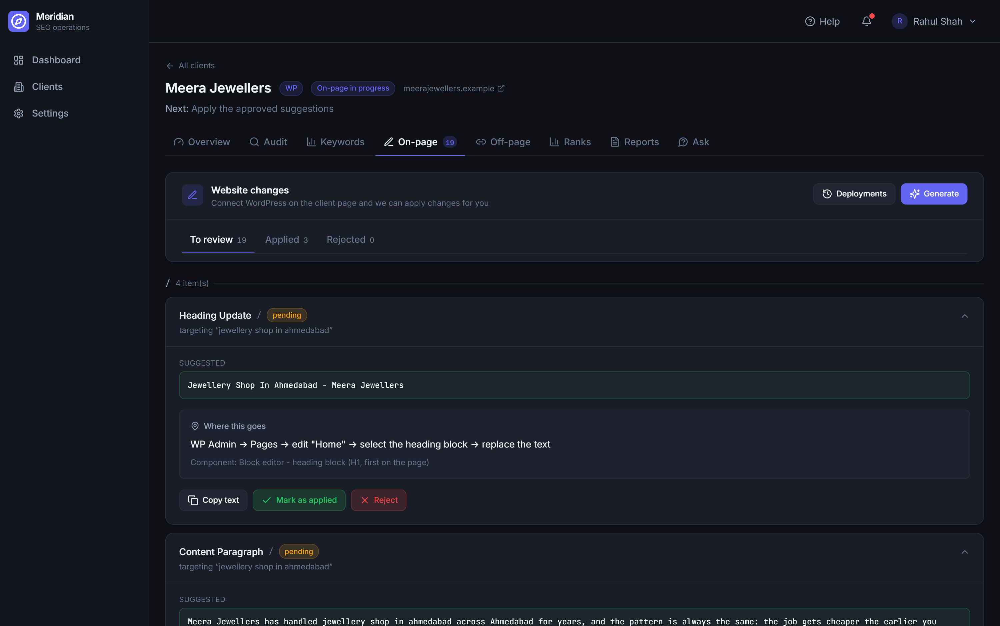</td>
</tr>
<tr>
<td width="50%">

**Ask the campaign**
Answers come from this client's own record — real dates, real actions — not generic SEO advice.

</td>
<td width="50%">

**A walkthrough on every screen**
Press **Help** and each real component gets ringed and explained. It only highlights; it never changes data.

</td>
</tr>
<tr>
<td>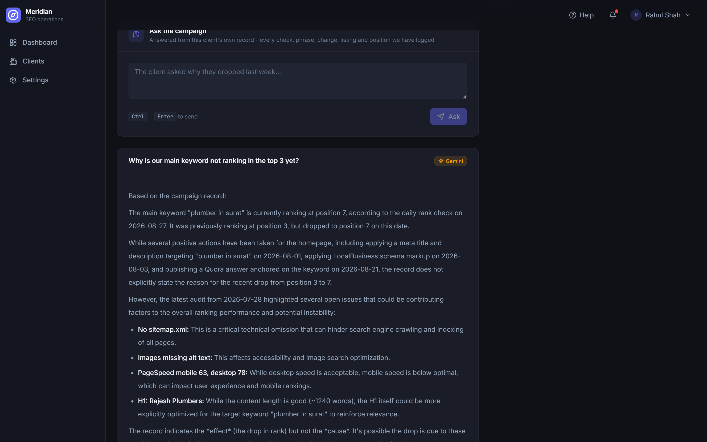</td>
<td>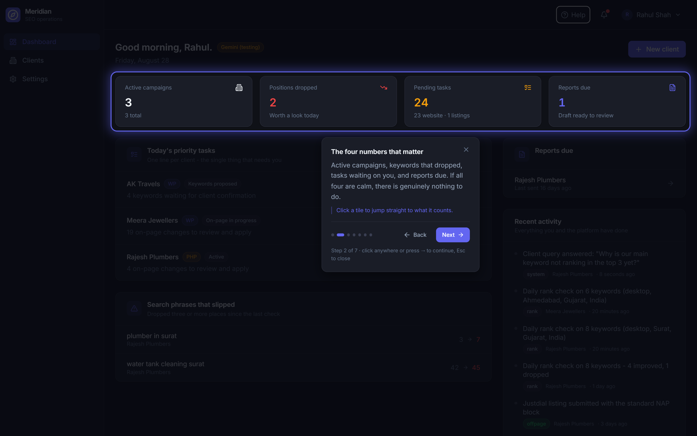</td>
</tr>
</table>

<details>
<summary><b>More screens</b> — audit, keyword map, off-page rotation, reports, client list, onboarding, sign-in</summary>

| | |
| --- | --- |
| **Website audit** — health score with weighted deductions and a typed issue list | 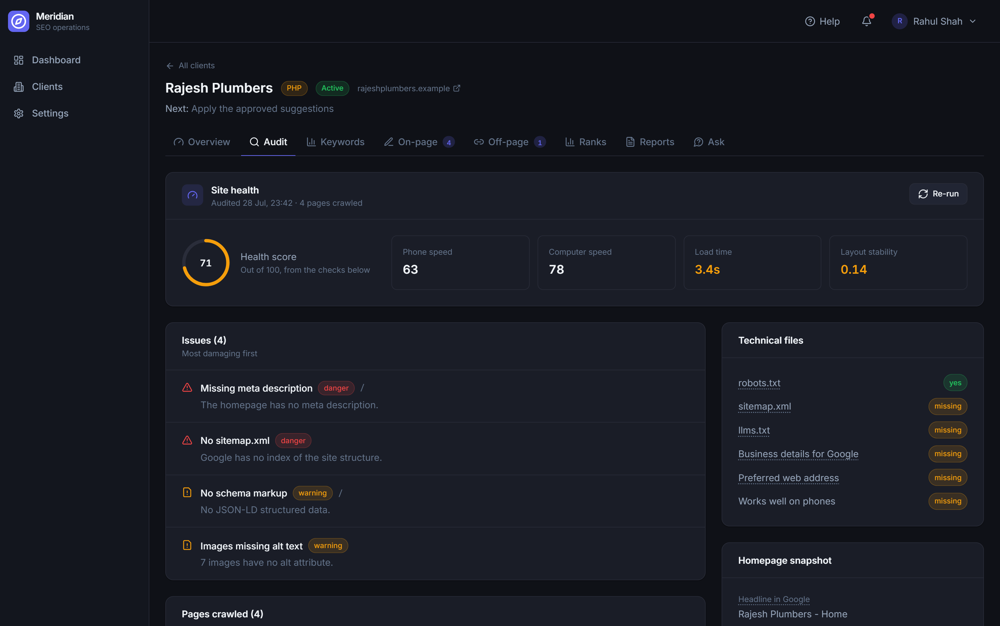 |
| **Keyword map** — one primary phrase per page, confirmed and locked with the client | 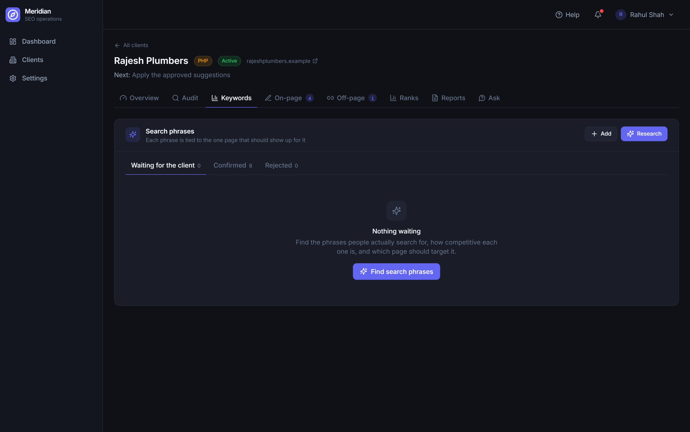 |
| **Off-page rotation** — next platform picked so nothing repeats inside its cooldown | 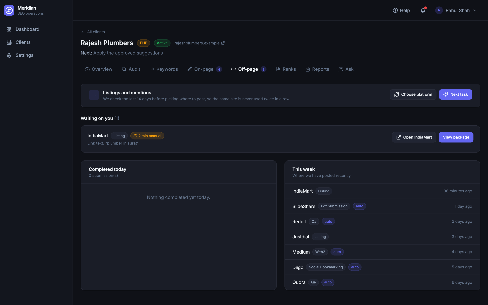 |
| **Bi-monthly report** — drafted from rank deltas and the activity log, sent as PDF | 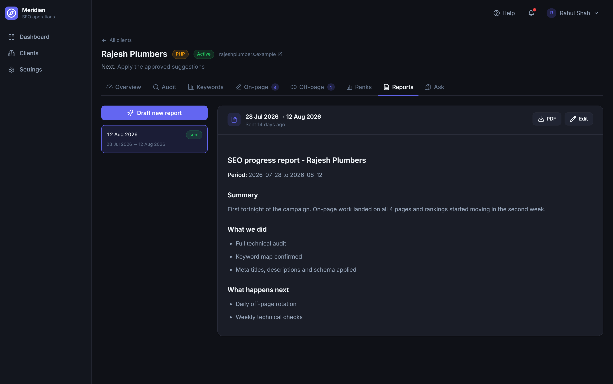 |
| **Client list** — searched in Postgres, debounced, cancellable | 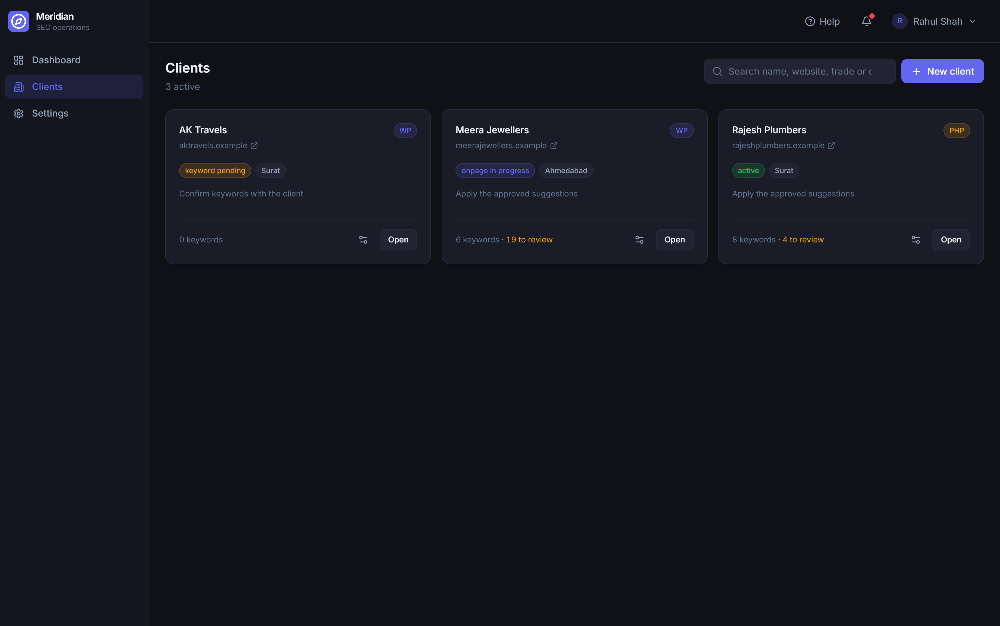 |
| **Onboarding** — cities from open data, biggest first, with a size hint | 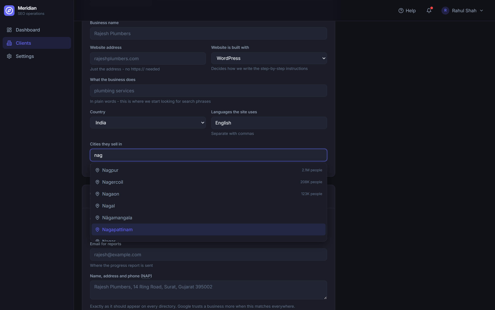 |
| **Sign-in** — one account, no hints | 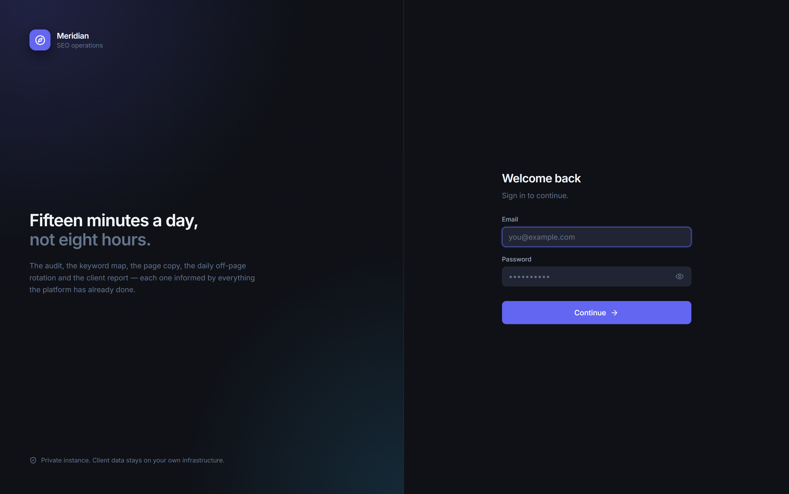 |
| **Second step** — a six-digit code, emailed | 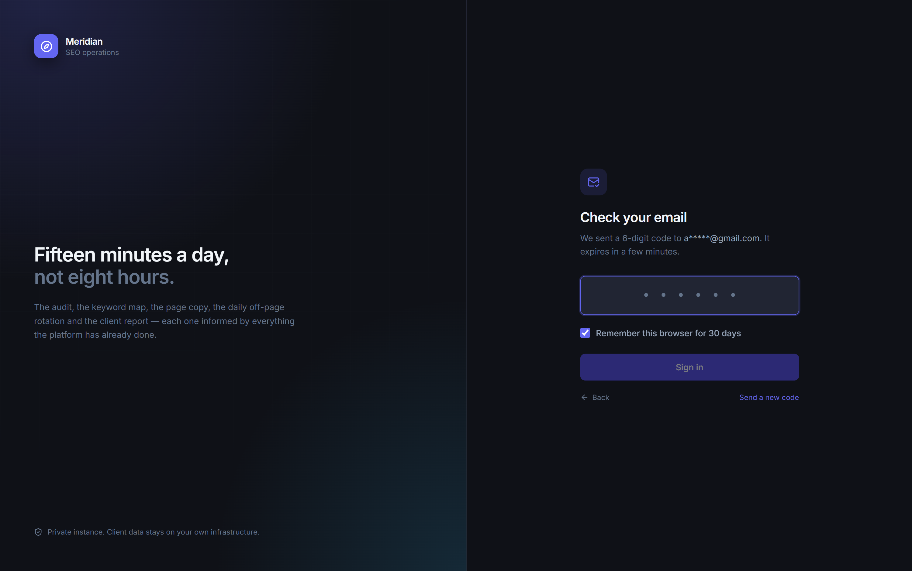 |

</details>

---

## Running it locally

You need the API running too — clone `meridian-api` beside this folder and start it first, or point
`VITE_API_PROXY` at a deployed one.

```bash
npm install
npm run dev          # http://localhost:3000
```

Two env files, Vite's own convention:

| File | In git | For |
| --- | :---: | --- |
| `.env` | yes | committed defaults, and the documented list of every setting |
| `.env.local` | no | your machine's overrides — wins over `.env`, line by line |

Both hold exactly two settings, and neither may ever hold a secret:

```bash
VITE_PORT=3000                          # dev server port
VITE_API_PROXY=http://localhost:8080    # where `npm run dev` forwards /api
```

> **Never put a secret behind a `VITE_` prefix.** Vite inlines those into the bundle it ships to every
> visitor. `VITE_API_PROXY` exists only for the dev server; in production `vercel.json` does the same
> job at the edge, and the bundle carries no host name at all.

---

## Deploying it

```bash
# 1. Deploy meridian-api to Render first - you need its URL.
# 2. Put that URL in vercel.json, replacing REPLACE-WITH-YOUR-RENDER-URL:
#      "destination": "https://meridian-api-xxxx.onrender.com/api/:path*"
# 3. Vercel -> Add New -> Project -> import this repository. It detects Vite,
#    builds with `npm run build`, serves dist/. No environment variables needed.
# 4. Back in Render, set FRONTEND_URL to the Vercel URL it just gave you.
```

Step 4 is not optional: `FRONTEND_URL` is the API's CORS allowlist and the origin Google returns to
after the Search Console consent screen.

Vercel serves this as static files, so the dashboard has no cold start — the shell paints instantly
even while the free Render instance is still asleep, and only the first API call waits for it to wake.

---

## What's in this repository

```
src/
  api/                 axios instance - access token in memory, silent refresh
                       on 401, CSRF header from the readable cookie, endpoint map
  components/ui/       Button · Card · DiffBlock · Term · CityPicker · EmptyState …
  components/tour/     the guided walkthrough
  pages/               one file per screen - thirteen of them
  lib/                 tour steps, formatting, the glossary
docs/screenshots/      the images above
vercel.json            the /api rewrite and the SPA fallback
vite.config.js         dev-server proxy, chunk splitting
```

**Four things worth pointing at:**

**The session never touches `localStorage`.** The access token lives in a module-scoped variable, so an
XSS cannot walk off with it; the refresh token is an `httpOnly` cookie the JavaScript cannot read at all.
A 401 triggers exactly one silent refresh and replays the original request — which is why there is a
`/api/auth/refresh` on every page load. That is the design working, not a bug.

**Search that stays responsive past the demo data.** The client list debounces the term by 300 ms and
cancels in-flight requests through TanStack Query's `AbortSignal`, holding the previous page on screen so
the list never flashes empty. Typing six characters produces exactly one request.

**The walkthrough measures instead of guessing.** Each step queries its real element, scrolls it into view
only if it is not already there, and re-measures on resize through a `ResizeObserver` — no fixed timeouts,
no scroll listener re-rendering the card on every frame. The ring carries the motion; the page underneath
stays still.

**Written for people who don't do SEO.** Every screen is in plain English — "Search phrases", not
"Keywords"; "Google positions", not "Rank tracker" — and the jargon that cannot be avoided is explained on
hover. A dotted underline means "point at this for a definition". About thirty terms live in
`src/components/ui/Term.jsx`; add one there and it explains itself everywhere.

---

## The half you can't see here

The API repository is where the interesting constraint lives. Every meaningful action writes a row to
`activity_log` and is embedded into a pgvector column; before any model call a context builder assembles
the campaign state, the top-8 semantically similar past actions, the last 20 activities, the latest audit,
the confirmed keyword list and the platforms used in the last 14 days — then adds the house rules that stop
the model repeating work it has already done. The **Ask** tab is that record queried directly.

It also runs with **no API keys at all**: every external integration degrades to a deterministic built-in
simulator, so the whole product works end to end before you spend anything. The badge in the header always
names the engine actually answering — `Claude`, `Gemini` or `Offline planner`.

---

## Sign-in

One account. No public sign-up, no account list on the login screen, and no hint of which address is the
real one — a wrong address fails exactly like a wrong password, in the same amount of time. After the
password, a six-digit code is emailed to that address; enter it once per browser and that browser is
remembered for thirty days.
